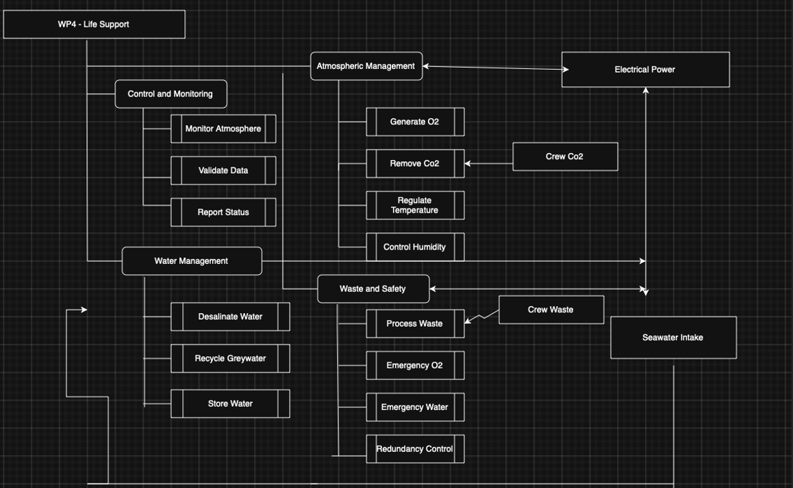

# North_Atlantic_Ocean_Habitat_Life_Support_System
# North Atlantic Ocean Habitat – Life Support System

Design of a closed-loop life support system capable of sustaining a ten-person underwater habitat operating in the North Atlantic Ocean.

This project was developed as part of an integrated engineering design study focusing on sustainable underwater habitation and long-duration scientific missions.

---

# Project Overview

The objective of this work package was to design a **fully integrated Life Support System (LSS)** capable of maintaining a stable and habitable internal environment for a crew of ten.
The design approach draws inspiration from research on buoyant architecture and closed ecological life support systems (Piątek, 2021; Escobar & Nabity, 2017).

The system integrates:

• Atmospheric management (oxygen generation and CO₂ removal)  
• Water production through seawater desalination  
• Greywater recycling  
• Environmental control (temperature and humidity)  
• Emergency life-support reserves  
• Control and monitoring infrastructure  

The habitat is assumed to operate west of Scotland in the **North Atlantic**, where environmental conditions include:

• Low seawater temperatures (5–15°C)  
• High salinity  
• Strong currents  
• Storm-prone surface conditions  

These constraints require **high reliability, redundancy, and corrosion-resistant materials**.

The design therefore follows a **systems engineering methodology** consisting of:

1. Requirement definition  
2. Functional architecture modelling  
3. Subsystem sizing calculations  
4. Material selection and lifecycle analysis  
5. Safety and emergency buffering  
6. Physical configuration design
     ## Life Support Functional Architecture
   
   

## Life Support System Subsystems

| Subsystem | Function |
|-----------|----------|
| Atmospheric Management | Oxygen generation, CO₂ removal, humidity control |
| Water Management | Desalination, potable water storage, recycling |
| Waste & Emergency Systems | Waste processing and emergency reserves |
| Control & Monitoring | Sensors, control unit, and system supervision |
## Physical Configuration Layout

life_support_configuration.png 
he subsystem layout is organised into four functional zones:
	1.	Atmospheric Management
	2.	Water Management
	3.	Waste & Emergency Systems
	4.	Control & Monitoring

Atmospheric systems are grouped to minimise duct length and improve gas circulation efficiency.

Water treatment components are located near the seawater intake to reduce pumping losses.

Emergency oxygen and water buffers are separated to prevent cascading failures.

A central maintenance corridor provides 1 m access clearance for inspection and maintenance.
## System Requirements

Key operational requirements were derived from human physiological limits and habitat operational constraints.

| Requirement | Target Value | Rationale |
|-------------|-------------|-----------|
| Oxygen concentration | 19–23 % | Safe human respiration |
| CO₂ concentration | < 5000 ppm | Prevent hypercapnia |
| Crew capacity | 10 persons | Mission requirement |
| Oxygen production | ≥ 10 kg/day | Metabolic demand |
| Potable water production | ≥ 200 L/day | Drinking, hygiene, electrolysis |
| Emergency autonomy | 48 hours | System failure survivability |
Atmospheric System Design

Oxygen Generation

Oxygen is produced through water electrolysis.

Reaction:

2H₂O → 2H₂ + O₂

From stoichiometry:

• 36 g water produces 32 g O₂
• 1 kg O₂ requires ≈ 1.125 kg water

Average oxygen consumption:

0.84 kg O₂ per person per day

For a crew of 10:

8.4 kg/day

Applying a 20% safety margin:

Required capacity ≈ 10 kg O₂/day

Water required for electrolysis:

10 × 1.125 = 11.25 kg water/day

⸻

Carbon Dioxide Removal

Human CO₂ production is approximately:

1 kg CO₂ per person per day

For 10 crew:

10 kg/day

Including 15% safety margin:

Required removal capacity:

≥ 11.5 kg CO₂/day

A regenerative amine scrubbing system is selected to enable continuous operation and lower consumable requirements.
### Water Demand Calculation

| Category | Consumption (L/day) |
|----------|---------------------|
| Drinking | 30 |
| Hygiene & food preparation | 150 |
| Electrolysis consumption | 11 |
| **Total baseline demand** | **161** |

Applying **25% system margin**:

Required desalination capacity ≈ **200 L/day**
Reverse Osmosis Desalination

Typical seawater reverse osmosis energy demand:

3–5 kWh per m³

For 200 L/day:

0.2 m³/day

Assuming 4 kWh/m³:

Energy consumption:

0.2 × 4 = 0.8 kWh/day

⸻

Greywater Recycling

Assuming 80% recovery efficiency:

150 × 0.8 = 120 L/day recovered

Net seawater intake required:
≈ 40 L/day

This significantly reduces desalination load and energy consumption.
## Emergency Resource Buffers

To maintain survivability during power outages or system faults, a **48-hour emergency reserve** is included.

| Resource | Storage Capacity |
|----------|------------------|
| Oxygen reserve | 20 kg |
| Emergency water | 400 L |

These reserves ensure life support during:

- Power system failure
- Severe weather conditions
- Maintenance downtime
- ## Equipment Specification

| Subsystem | Equipment | Capacity |
|----------|----------|----------|
| Oxygen Generation | PEM Electrolyser | 10 kg O₂/day |
| CO₂ Removal | Regenerative Amine Scrubber | 11.5 kg/day |
| Atmospheric Control | HVAC + Dehumidifier | Dew point < 12°C |
| Desalination | Reverse Osmosis Unit | 200 L/day |
| Water Storage | Potable Tank | 300 L |
## Subsystem Mass Estimate

Estimated material distribution for major life-support components:

| Component | Material | Estimated Mass |
|----------|----------|---------------|
| Desalination unit & piping | 316L Stainless Steel | 5000 kg |
| Water & greywater tanks | HDPE | 1500 kg |
| Control housings & frames | Aluminium | 1000 kg |

**Total estimated subsystem mass:**

**7500 kg**
## Material Selection

Materials were selected based on corrosion resistance, durability, and lifecycle environmental performance.

| Material | Application | Reason |
|----------|-------------|--------|
| 316L Stainless Steel | Desalination chambers & piping | Chloride corrosion resistance |
| HDPE | Water storage tanks | Chemical resistance and low weight |
| Aluminium 6061-T6 | Control structures | High strength-to-weight ratio |
| Titanium alloy | Critical seawater components | Exceptional corrosion resistance |
habitat_system_overview.png
## Lifecycle Environmental Analysis

Using **CES EduPack** data, the estimated material impact is:

**Total embodied energy:**

≈ 540,000 MJ

**Total carbon footprint:**

≈ 26,750 kg CO₂

### Lifecycle Phase Breakdown

| Phase | Energy (%) | CO₂ (%) |
|------|-----------|---------|
| Material production | 95 | 96 |
| Manufacturing | 3 | 3 |
| Transport | 1 | 1 |
| Disposal | <1 | <1 |

Material production dominates lifecycle emissions.

Therefore material selection prioritised:

- corrosion resistance  
- long service life  
- reduced replacement cycles
- ## Sustainability Impact

The project contributes to multiple **UN Sustainable Development Goals (SDGs):**

| SDG | Contribution |
|-----|-------------|
| SDG 6 | Clean water through recycling |
| SDG 7 | Energy-efficient life support |
| SDG 9 | Sustainable marine infrastructure |
| SDG 13 | Climate-conscious design |
| SDG 14 | Protection of marine ecosystems |

habitat_system_overview.png
## Key Engineering Outcomes

The final design demonstrates:

- Continuous atmospheric control for a crew of 10
- Closed-loop water management with greywater recycling
- Energy-efficient seawater desalination system
- Corrosion-resistant material selection for marine environments
- 48-hour emergency life-support autonomy
- Integrated subsystem architecture for long-duration underwater missions

---

## Tools and Methods

This project utilised:

- Systems engineering methodology
- Functional flow modelling
- Lifecycle environmental analysis (CES EduPack)
- Engineering calculations and subsystem sizing
- Sustainable design principles
  ## References

1. Piątek, Ł. (2021).  
   *Displacing Architecture? From Floating Houses to Ocean Habitats: Expanding the Building Typology.*  
   Floating Solutions Conference.  
   Available at: https://floatingsolutions.org/wp-content/uploads/2021/11/Piatek_Lukasz_Displacing_Architecture.pdf

2. Escobar, C., & Nabity, J. (2017).  
   *Past, Present, and Future of Closed Human Life Support Ecosystems – A Review.*  
   47th International Conference on Environmental Systems (ICES).  
   Available at: http://hdl.handle.net/2346/73083

3. Jones, H. W. (2016).  
   *Systems Engineering for Closed Environmental Life Support Systems.*  
   NASA Environmental Control and Life Support System (ECLSS) Research.
